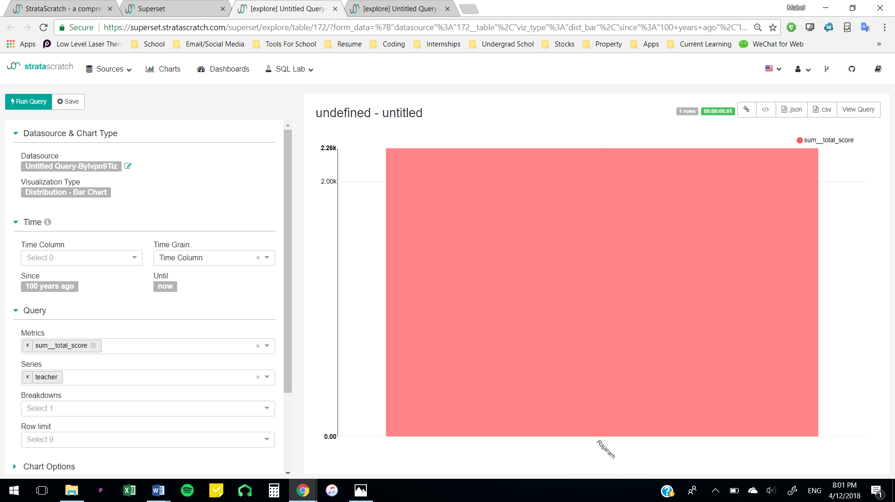
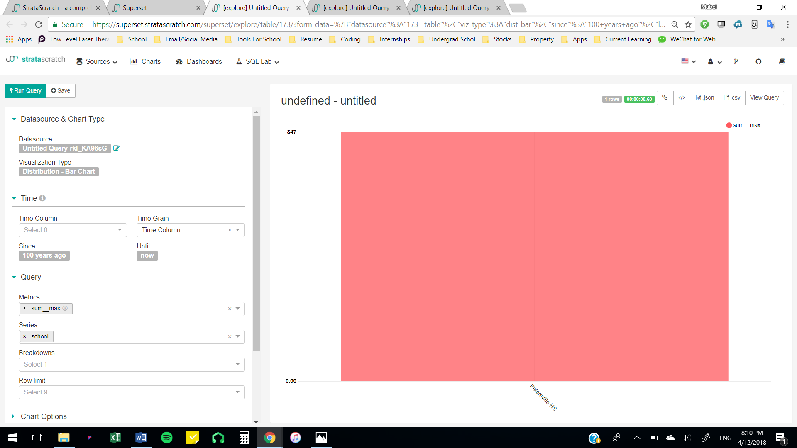
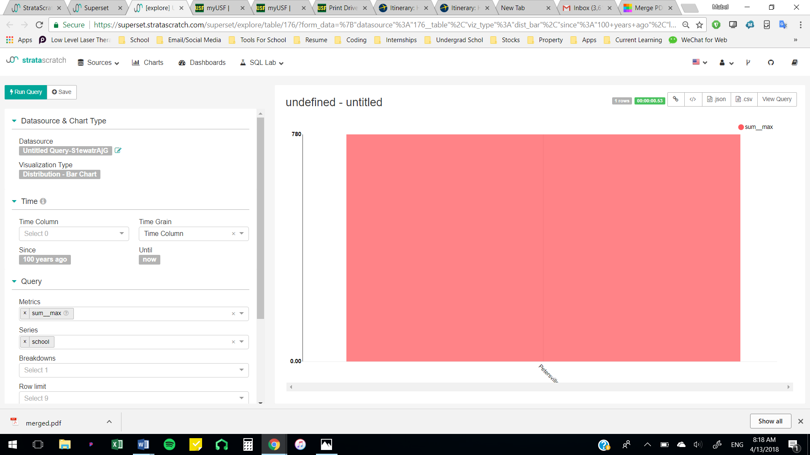

# datasets-ICA4
ICA 4 questions, code, and visualizations

## Description of datasets.sat_scores
SAT scores from different schoolds, teachers, and students.

## Question #1
What school had the student with the highest sat score?

```sql
SELECT school, sat_math+sat_verbal as Total_score
FROM datasets.sat_scores
ORDER BY Total_score DESC 
LIMIT 1
```



## Question #2
What was the highest math sat score for Petersville highschool?

```sql
SELECT school, MAX (sat_math) as max
FROM datasets.sat_scores
WHERE school = 'Petersville HS'
GROUP BY sat_math. school
LIMIT 1
```



## Question #3
What was the highest sat verbal score for Petersville HS?
```sql
SELECT school, MAX (sat_verbal) as filter_price_max
FROM datasets.sat_scores
WHERE school = 'Petersville HS'
GROUP BY sat_verbal, school
LIMIT 1
```



## Question #4
What was the lowest math score for Washington hs students?
```sql
SELECT sat_math, school
FROM datasets.sat_scores
WHERE school = 'Washington HS'
ORDER BY sat_math ASC
LIMIT 1
```


